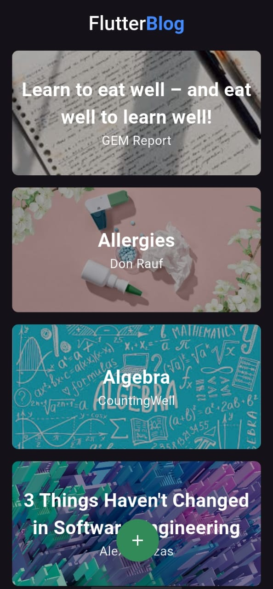

# Flutter Blog App

## Overview
This is a **Flutter Blog App** that allows users to create, read, and display blog posts using **Firebase Firestore** for data storage and **Cloudinary** for image hosting. The app features a modern UI with smooth navigation and real-time data fetching using **StreamBuilder**.

## Features
- 📌 **Create, Read, and Display Blogs**
- 🌐 **Fetch blog details from Firebase Firestore**
- 🖼 **Upload and display images from Cloudinary**
- 🔄 **Real-time updates using StreamBuilder**
- 📱 **Modern UI with a responsive design**
- ➕ **Floating Action Button for adding blogs**
- 📝 **Detailed blog view on click**

## Tech Stack
- **Flutter (Dart)** - Frontend
- **Firebase Firestore** - Database
- **Cloudinary** - Image Hosting

## Installation & Setup
1. **Clone the repository:**
   ```bash
   git clone https://github.com/bilal-ahmed07/Blog-Application.git
   cd Blog-Application
   ```

2. **Install dependencies:**
   ```bash
   flutter pub get
   ```

3. **Configure Firebase:**
   - Set up Firebase for your Flutter project.
   - Add `google-services.json` (for Android) and `GoogleService-Info.plist` (for iOS).

4. **Run the app:**
   ```bash
   flutter run
   ```

## Screenshots
| Home Page | Blog Details |
|-----------|-------------|
|  |  |

## Contributing
Feel free to fork the repo and submit a pull request! Contributions are welcome.

